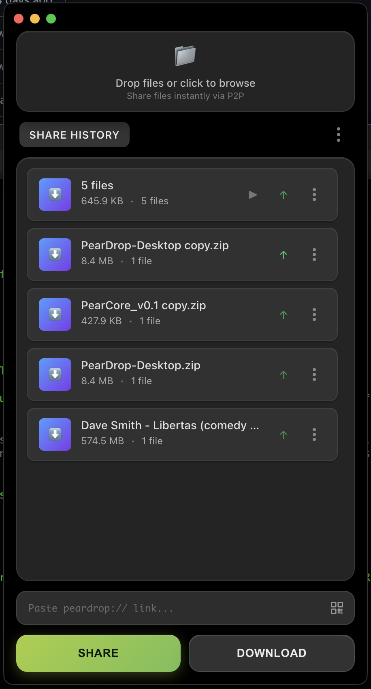
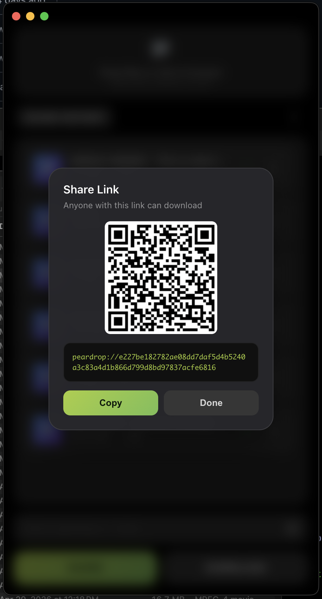
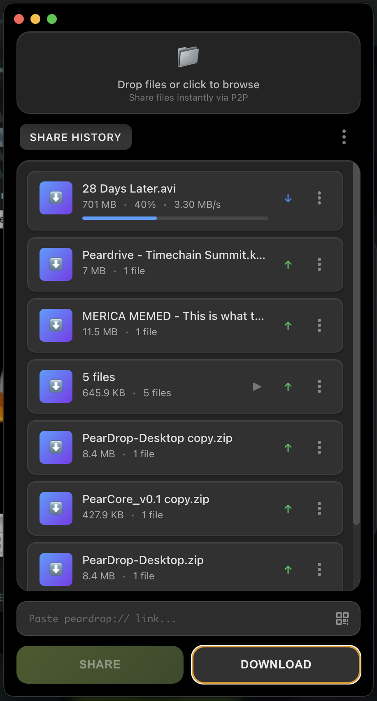
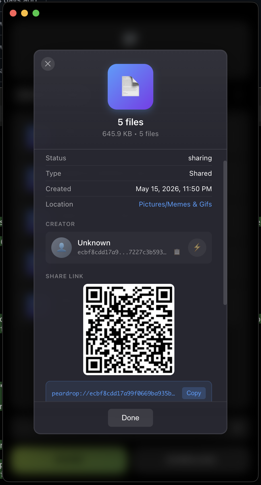
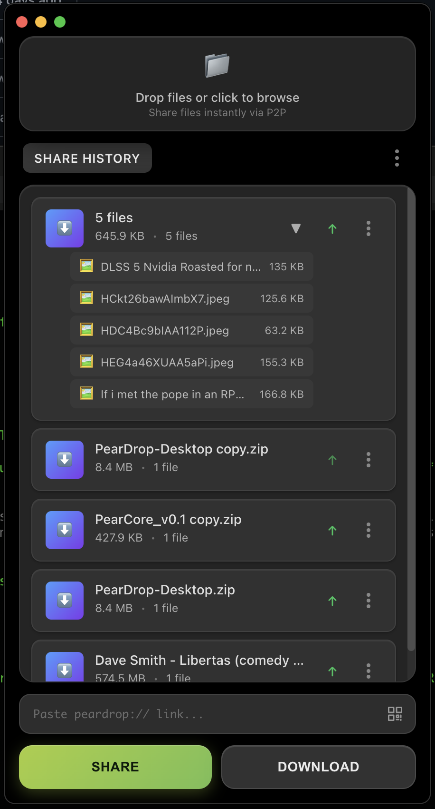

# 🍐 PearDrop

**The file sharing app that actually works the way you expect it to.**

No accounts. No limits. No bullshit. Just drop a file, get a link, send it to whoever needs it. They click it, they get the file. Done.

## 📸 See It In Action

<div align="center">
  
  
</div>

<div align="center">
  
  
</div>

<div align="center">
  
</div>

---

## 🤔 Why This Exists

Every other file sharing service:
- Requires you to create an account
- Stores your files on their servers
- Has arbitrary size limits
- Dies when the company goes under
- Tracks everything you do

PearDrop:
- **Zero accounts** → Works immediately
- **True P2P** → Files go directly between you and them
- **No limits** → Share 50GB movies if you want
- **Unstoppable** → Decentralized, no single point of failure
- **Private** → No tracking, no data collection, no surveillance capitalism

---

## 🚀 How It Works

### Sharing Files
1. **Drag & drop** files into the app
2. Click **"SHARE"**
3. **Copy the link** (`peardrop://abc123...`)
4. **Send it** to whoever needs the files

### Getting Files
1. **Paste the link** into the app (or scan its QR code)
2. Click **"DOWNLOAD"**
3. **Files appear** in `~/peardrop/downloads/`

That's literally it. No registrations, no uploads to "the cloud," no waiting for some server to process your stuff.

**One thing to know:** this is true peer-to-peer — there is no server holding your files. The sharing device must be online (with the app running) for someone to download from it. Shares persist across app restarts and re-announce automatically.

---

## 🛠 Getting Started

### Requirements
- Node.js 18+ and npm
- macOS, Windows, or Linux

### Build From Source
```bash
git clone https://github.com/peardrive/PearDrop-Desktop.git
cd PearDrop-Desktop
npm install
npm start
```

### CLI
A command-line tool ships in `bin/peardrop`:
```bash
peardrop share <file>          # share a file, prints the peardrop:// link
peardrop download <link> [dir] # download from a link
peardrop list                  # active shares
peardrop status                # statistics
peardrop stop                  # stop all shares
```

---

## 🔧 Technical Details

**Built on battle-tested tech:**
- **[Hyperdrive](https://docs.pears.com/building-blocks/hyperdrive)** - Distributed file system from the Hypercore Protocol
- **[Hyperswarm](https://docs.pears.com/building-blocks/hyperswarm)** - P2P networking that punches through NAT/firewalls
- **Electron** - Cross-platform desktop app framework

**No size limits:**
- Streams files in chunks
- Works with files of any size
- Memory efficient

**Safe by design:**
- Downloads are path-traversal guarded — a malicious share can't write outside your downloads folder
- Drive state is written atomically — a crash mid-write can't corrupt your share list
- State loading is strictly non-destructive — a corrupted state file is backed up and never causes data loss
- A stalled peer fails the transfer cleanly instead of hanging forever
- Single-instance lock — a second launch focuses the running app instead of fighting over storage

---

## 📁 File Storage

```
~/peardrop/
├── drives/              # P2P drive data (one folder per share)
├── drives-state.json    # Share list (atomic writes, non-destructive loads)
└── downloads/           # Your downloaded files end up here
```

Shared drive data stays in `~/peardrop/drives/` until you remove the share from the app — that's what lets shares survive restarts.

---

## 🎨 Features

### ✅ Currently Working
- **Unlimited file sizes** - Share anything
- **Real P2P transfers** - Direct peer-to-peer connections with live progress and speed
- **Persistent shares** - Shares survive app restarts and re-announce automatically
- **Pause / Resume** - Stop announcing a share without deleting it; resume rejoins the swarm
- **Auto-discovery** - No manual IP addresses or port forwarding
- **QR codes** - Show a QR for any share; scan one to auto-start a download
- **Peer visibility** - See how many peers are connected to each share
- **CLI tool** - Command line interface for automation
- **Cross-platform** - Windows, Mac, Linux
- **Clean UI** - Dark theme with glassmorphism design

### 🔮 Roadmap
- **Mobile apps** - iOS and Android clients
- **Receive links** - A QR others can use to send files TO you
- **Device cloud** - Link your own devices so they assist each other's transfers (built on pearcore)
- **Link expiration** - Set time limits on shares
- **Download history** - Track past transfers

---

## 🌍 The Bigger Picture

PearDrop is part of building a **decentralized internet** where:
- You own your data
- No company can deplatform you
- Tools work without permission from gatekeepers
- Privacy is the default, not a premium feature

This is how the internet was supposed to work.

---

## 🤝 Contributing

**Found a bug?** Open an issue.
**Want to add a feature?** Fork it and send a PR.
**Have questions?** Start a discussion.

**Code style:** We keep it simple. Follow existing patterns, add comments for complex stuff, test your changes.

**Architecture:** Read `CLAUDE.md` before touching code — it documents the sacred core (the basic share→download flow that must never break), the component architecture, and hard-won lessons. New features should be isolated modules.

---

## ⚖️ License

**GPL v3** - Because freedom should stay free.

You can use, modify, and distribute this code. If you improve it, those improvements must also be free and open source. This prevents companies from taking our work and making it proprietary.

---

## 🙏 Built With

- **[Hypercore Protocol / Pears](https://docs.pears.com/)** - The P2P foundation
- **[Electron](https://electronjs.org/)** - Cross-platform desktop apps
- **Your feedback** - Keep the issues and suggestions coming

---

*Stop feeding Big Tech your data. Take back control of your files.*
